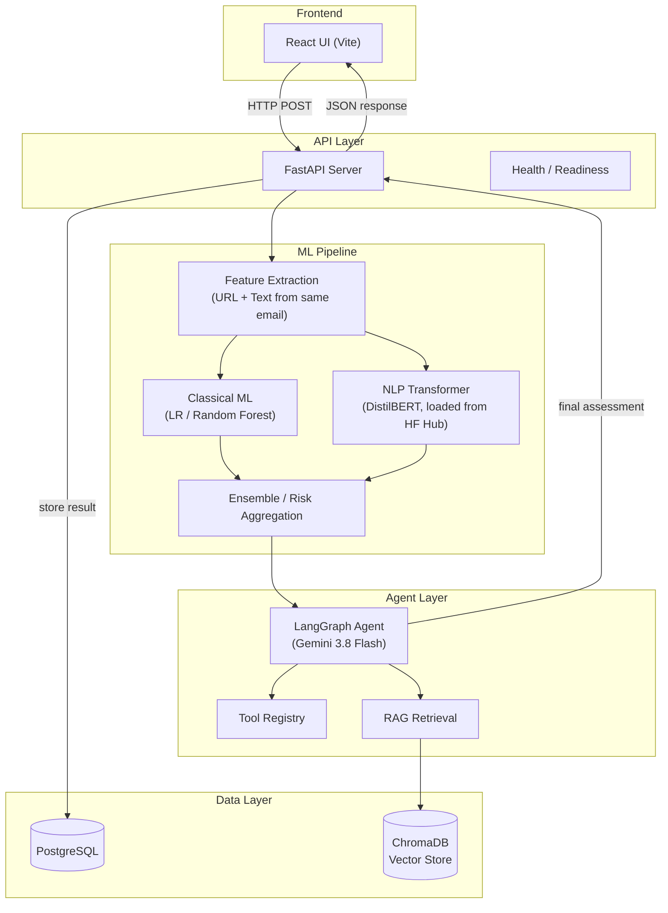
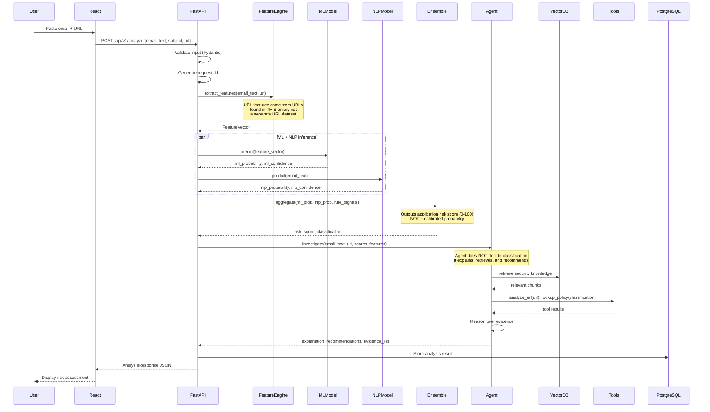
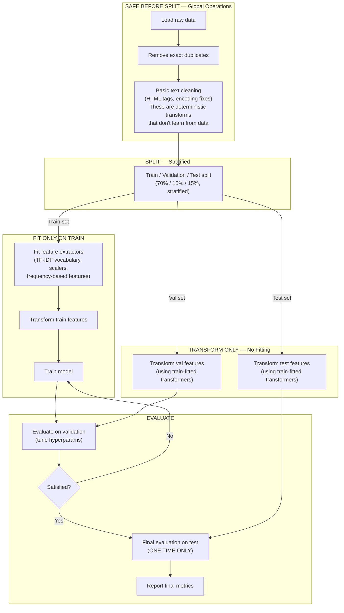
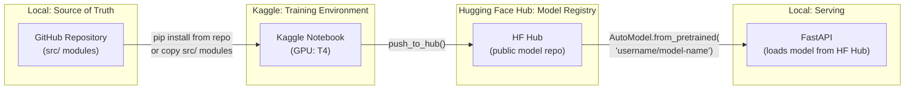
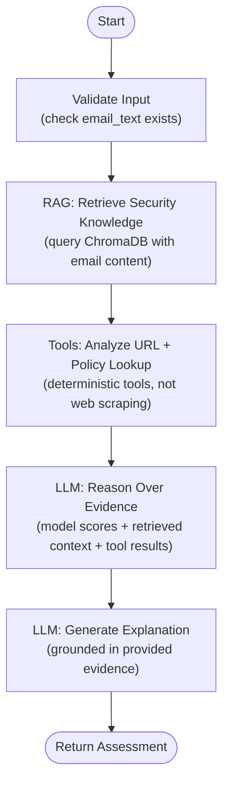
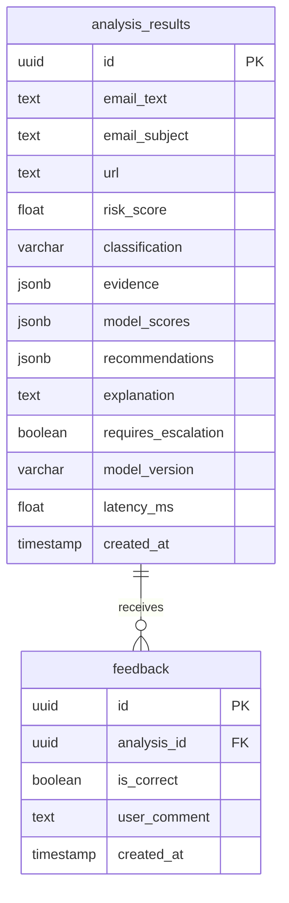

# AI Phishing Risk & Security Triage Platform — Implementation Plan (Revised)

> **Status**: PLAN MODE — awaiting final approval before any code is written.
> **Revision**: v2 — incorporates all 13 corrections from review.
> **Scope**: Single-student portfolio project optimized for learning, evaluation, and interview defensibility.

---

## Table of Contents

1. [Product Objective & User Workflow](#1-product-objective--user-workflow)
2. [Final Architecture](#2-final-architecture)
3. [Data Flow](#3-data-flow)
4. [Repository Structure](#4-repository-structure)
5. [Technology Choices](#5-technology-choices)
6. [Dataset Strategy](#6-dataset-strategy)
7. [ML Pipeline (with Leakage Prevention)](#7-ml-pipeline-with-leakage-prevention)
8. [NLP Pipeline](#8-nlp-pipeline)
9. [Compute Strategy & Model Training Workflow](#9-compute-strategy--model-training-workflow)
10. [Evaluation Strategy](#10-evaluation-strategy)
11. [Ensemble & Risk Score Semantics](#11-ensemble--risk-score-semantics)
12. [Agent / LangGraph Architecture](#12-agent--langgraph-architecture)
13. [RAG Architecture](#13-rag-architecture)
14. [FastAPI Architecture](#14-fastapi-architecture)
15. [Database Design](#15-database-design)
16. [React Structure](#16-react-structure)
17. [Testing Strategy](#17-testing-strategy)
18. [Observability](#18-observability)
19. [Deployment Approach](#19-deployment-approach)
20. [Development Phases](#20-development-phases)
21. [Learning Checkpoints](#21-learning-checkpoints)
22. [MVP vs Optional Scope](#22-mvp-vs-optional-scope)
23. [Risks & Likely Failure Points](#23-risks--likely-failure-points)
24. [Definition of Done](#24-definition-of-done)
25. [Learning Documentation Plan](#25-learning-documentation-plan)

---

## 1. Product Objective & User Workflow

### What the system does

A user pastes a suspicious email (subject + body + optional URL) into a web interface. The platform returns a structured risk assessment with:

- A numerical **application risk score** (0–100) — explicitly not a calibrated probability
- A **classification** (Low / Medium / High / Critical) derived from deterministic thresholds
- **Evidence list** — why each signal flagged or cleared
- **Model-level breakdown** — ML model probability, NLP model probability, rule-based signals
- **Recommended action** — allow / quarantine / escalate
- **Natural-language explanation** — generated by the LangGraph agent, grounded in evidence

### User workflow

```
User pastes email text + subject + optional URL
       ↓
React UI → POST /api/v1/analyze → FastAPI
       ↓
Feature extraction from THE SAME email sample:
  • text features (word count, urgency signals, etc.)
  • URL features (extracted from URLs in the email body, if any)
       ↓
Classical ML model → phishing probability
       ↓
NLP transformer model → phishing probability
       ↓
Ensemble / risk aggregation → application risk score + classification
       ↓
LangGraph agent orchestrates:
  • RAG retrieval (security knowledge)
  • Tool calls (URL structure analyzer, policy lookup)
  • Evidence reasoning
  • Explanation generation
  • Escalation routing
       ↓
Final risk assessment stored in PostgreSQL
       ↓
Response returned to React UI
       ↓
User reviews assessment, optional feedback
```

---

## 2. Final Architecture

### System diagram



### Architecture style: Modular Monolith

All backend code lives in one Python process. Internal boundaries are enforced through clean module separation, not network calls.

**Why not microservices?**
- Single developer — no team scaling requirement
- No independent scaling needs
- Lower operational complexity
- Easier to debug and test
- Still demonstrates clean separation of concerns

---

## 3. Data Flow

### Detailed data flow for a single analysis request



### Key data objects

| Object | Description | Created By |
|--------|-------------|------------|
| `AnalysisRequest` | Raw input: email text, subject, URL | User via API |
| `FeatureVector` | Extracted numerical/categorical features from the same email | Feature Engine |
| `MLPrediction` | ML model phishing probability | Classical ML |
| `NLPPrediction` | NLP model phishing probability | NLP Transformer |
| `RiskAssessment` | Application risk score (0–100) + classification (from thresholds) | Ensemble |
| `AgentInvestigation` | Explanation, evidence, recommendations | LangGraph Agent |
| `AnalysisResult` | Complete response stored and returned | FastAPI |

---

## 4. Repository Structure

```
AI-PhishingRiskPlatform/
│
├── AGENTS.md                           # Agent rules
├── README.md                           # Project overview
├── .env.example                        # Environment config template
├── .gitignore
├── pyproject.toml                      # Python project config (dependencies)
│
├── .agents/                            # Antigravity agent skills
│   └── skills/
│       └── phishing-ai-engineering/
│
├── docs/
│   ├── architecture.md                 # Architecture diagram + decisions
│   ├── api.md                          # API documentation
│   ├── evaluation_results.md           # Real evaluation results
│   ├── setup.md                        # Setup instructions
│   └── learning/                       # Progressive learning notes
│       ├── architecture.md
│       ├── python-ml.md
│       ├── ml-evaluation.md
│       ├── feature-engineering.md
│       ├── nlp-transformers.md
│       ├── fastapi.md
│       ├── rag-retrieval.md
│       ├── agents-langgraph.md
│       ├── testing.md
│       └── observability.md
│
├── data/
│   ├── raw/                            # Original dataset files (gitignored)
│   ├── processed/                      # Preprocessed splits (gitignored)
│   └── knowledge_base/                 # RAG source documents (committed)
│       ├── phishing_indicators.md      # From authoritative public sources
│       ├── attack_patterns.md          # From authoritative public sources
│       ├── security_policies.md        # Labeled MOCK — project-specific
│       └── incident_response.md        # Labeled MOCK — project-specific
│
├── notebooks/                          # Exploration & training (NOT source of truth)
│   ├── README.md                       # Explains notebook vs src/ boundary
│   ├── 01_data_exploration.ipynb
│   └── 02_nlp_training.ipynb           # Kaggle/Colab training notebook
│
├── src/
│   ├── __init__.py
│   ├── config.py                       # Settings, env vars, constants
│   │
│   ├── data/                           # Data loading & preprocessing
│   │   ├── __init__.py
│   │   ├── loader.py                   # Dataset loading
│   │   ├── preprocessor.py             # Text/data cleaning
│   │   └── splitter.py                 # Train/val/test splitting
│   │
│   ├── features/                       # Feature engineering
│   │   ├── __init__.py
│   │   ├── url_features.py             # URL-based features
│   │   ├── text_features.py            # Text/email features
│   │   └── feature_pipeline.py         # Combined feature pipeline
│   │
│   ├── models/                         # ML & NLP models
│   │   ├── __init__.py
│   │   ├── baseline.py                 # Logistic Regression baseline
│   │   ├── classifier.py               # Random Forest classifier
│   │   ├── nlp_classifier.py           # Transformer-based NLP
│   │   ├── ensemble.py                 # Risk aggregation
│   │   └── registry.py                 # Model loading/versioning
│   │
│   ├── evaluation/                     # Evaluation pipeline
│   │   ├── __init__.py
│   │   ├── metrics.py                  # Metric computation
│   │   ├── evaluator.py                # Run evaluations
│   │   └── reports.py                  # Generate eval reports
│   │
│   ├── agent/                          # LangGraph agent
│   │   ├── __init__.py
│   │   ├── state.py                    # Agent state definition
│   │   ├── graph.py                    # LangGraph workflow
│   │   ├── nodes.py                    # Graph node functions
│   │   └── tools.py                    # Agent tools
│   │
│   ├── rag/                            # RAG pipeline
│   │   ├── __init__.py
│   │   ├── indexer.py                  # Document chunking + indexing
│   │   ├── retriever.py                # Vector retrieval
│   │   └── knowledge_base.py           # KB management
│   │
│   ├── api/                            # FastAPI application
│   │   ├── __init__.py
│   │   ├── app.py                      # FastAPI app factory
│   │   ├── routes/
│   │   │   ├── __init__.py
│   │   │   ├── analysis.py             # POST /api/v1/analyze
│   │   │   ├── health.py               # GET /health
│   │   │   └── feedback.py             # POST /api/v1/feedback
│   │   ├── schemas.py                  # Pydantic request/response models
│   │   ├── dependencies.py             # Dependency injection
│   │   └── middleware.py               # Request ID, logging, error handling
│   │
│   ├── services/                       # Business logic (orchestration)
│   │   ├── __init__.py
│   │   └── analysis_service.py         # Main analysis orchestration
│   │
│   └── db/                             # Database layer
│       ├── __init__.py
│       ├── models.py                   # SQLAlchemy models
│       ├── session.py                  # DB session management
│       └── repository.py              # Data access functions
│
├── scripts/                            # Utility scripts
│   ├── train_ml.py                     # Train classical ML model
│   ├── evaluate.py                     # Run evaluation pipeline
│   ├── index_knowledge_base.py         # Index RAG documents
│   └── seed_db.py                      # Database setup
│
├── tests/
│   ├── __init__.py
│   ├── conftest.py                     # Shared fixtures
│   ├── test_features/
│   │   ├── test_url_features.py
│   │   └── test_text_features.py
│   ├── test_models/
│   │   ├── test_baseline.py
│   │   └── test_ensemble.py
│   ├── test_api/
│   │   ├── test_analysis.py
│   │   └── test_health.py
│   ├── test_agent/
│   │   └── test_tools.py
│   └── test_rag/
│       └── test_retriever.py
│
├── frontend/                           # React application
│   ├── package.json
│   ├── vite.config.js
│   ├── index.html
│   ├── public/
│   └── src/
│       ├── main.jsx
│       ├── App.jsx
│       ├── index.css
│       ├── api/
│       │   └── client.js               # API client
│       ├── components/
│       │   ├── AnalysisForm.jsx
│       │   ├── RiskScore.jsx
│       │   ├── EvidenceList.jsx
│       │   ├── ModelBreakdown.jsx
│       │   └── Recommendations.jsx
│       └── pages/
│           └── AnalyzePage.jsx
│
└── model_artifacts/                    # Local model cache (gitignored)
    └── ml/                             # Saved scikit-learn models
```

> [!NOTE]
> **NLP model artifacts are NOT stored in the repo.** They are pushed to Hugging Face Hub from Kaggle/Colab and loaded at runtime. Only the classical ML models (small joblib files) are saved locally.

> [!NOTE]
> Files and directories are created incrementally phase-by-phase. This structure represents the final target.

---

## 5. Technology Choices

### Core stack

| Technology | Purpose | Why This Choice |
|------------|---------|-----------------|
| **Python 3.11+** | Backend / ML / API | Industry standard for ML/AI; scikit-learn, PyTorch, FastAPI all Python |
| **scikit-learn** | Classical ML models | Standard library; simple API; best for learning ML fundamentals |
| **PyTorch** | NLP model training | Industry standard for DL; needed for HF Transformers |
| **Hugging Face Transformers** | Pre-trained NLP model | Standard for transformer models; `push_to_hub` for model hosting |
| **Hugging Face Hub** | Model artifact hosting | Free for public models; clean download API; replaces local model storage for NLP |
| **FastAPI** | REST API | Async, type-safe, Pydantic integration; modern Python API standard |
| **Pydantic v2** | Data validation | Type safety, serialization, FastAPI integration |
| **LangGraph** | Agent orchestration | Stateful graph-based agent; developer already knows it; interview-relevant |
| **LangChain (core only)** | LLM interface layer | Standard LLM integration; needed for LangGraph |
| **ChromaDB** | Vector store (RAG) | Embedded, persistent, no extra infra; sufficient for small KB |
| **PostgreSQL** | Relational database | Developer already knows it; stores analysis results, feedback |
| **SQLAlchemy** | ORM | Standard Python ORM; clean DB abstraction |
| **React + Vite** | Frontend | Developer already knows React; Vite is fast; minimal setup |
| **pytest** | Testing | Standard Python test framework |
| **structlog** | Structured logging | Clean JSON logs; easy to search |
| **pandas** | Data manipulation | Standard for ML data workflows |

### LLM provider

| Role | Provider | Model | Reason |
|------|----------|-------|--------|
| **Primary** | Google AI Studio | **Gemini 3.8 Flash** | Free tier available; supports tool calling; flagship model for new projects |
| **Fallback** | Groq | **Llama 3.3 70B** (or best available open-weight model) | Free tier; OpenAI-compatible API; fast inference |

**Implementation approach:**
- Configure LLM via environment variables (`LLM_PROVIDER`, `LLM_MODEL`, `LLM_API_KEY`)
- Use LangChain's provider abstraction — switch provider by changing config, not code
- Default to Gemini 3.8 Flash; Groq as fallback if Gemini quota is hit
- Do NOT build multi-provider as a product feature — this is just config flexibility

### Explicitly NOT using

| Technology | Why Not |
|------------|---------|
| GPT-4o / OpenAI | No free tier; not needed when Gemini has free tier with tool calling |
| Kafka | No streaming requirement; overkill |
| Kubernetes | Single-developer project; Docker Compose sufficient |
| Spark | Dataset is small; pandas is enough |
| Redis | No caching/queue requirement in MVP |
| Celery | Analysis is fast enough to be synchronous initially |
| Neo4j | ChromaDB is sufficient for the knowledge base |
| MLflow | Simple file-based tracking + documented results is sufficient |
| XGBoost | Removed — LR → RF is a cleaner teaching progression |
| TensorFlow | PyTorch is more common in research; one DL framework is enough |
| Django | FastAPI is lighter, more modern, better for ML serving |
| Multi-agent system | Single agent with tools is sufficient |

---

## 6. Dataset Strategy

### Primary dataset: Phishing Email Text

**Selected**: [Phishing Email Dataset (Kaggle, ~82K emails)](https://www.kaggle.com/datasets/subhajitroy/phishing-email-dataset)

| Property | Detail |
|----------|--------|
| Size | ~82,500 emails |
| Classes | Phishing / Legitimate (binary) |
| Content | Subject + body text |
| Sources | Enron, Ling, CEAS, SpamAssassin, Nazario |
| Format | CSV |

**Why this dataset:**
- Large enough for real ML training
- Has actual email text (needed for both ML text features AND NLP transformer)
- Mixed sources reduce single-source bias
- Binary classification with clear label semantics

### What about URL features?

> [!IMPORTANT]
> **Corrected design**: URL features are extracted from URLs found **within the email text itself**, not from a separate URL dataset.

The workflow for a single email sample:

```
Email sample from dataset
  ├── email_text → text features (word count, urgency signals, etc.)
  ├── email_text → extract URLs (regex) → URL features (length, dots, IP, TLD, etc.)
  └── email_text → NLP transformer → phishing probability
```

If an email has no URL, the URL features are set to zero/defaults. This is realistic — not all phishing emails contain URLs.

The separate PhiUSIIL URL dataset (UCI, ~235K URLs) may be used as:
- A **reference** for learning feature engineering concepts
- A **validation source** for testing URL feature extraction logic
- It is **NOT combined row-by-row** with the email dataset

### Known dataset issues to handle

| Issue | Mitigation |
|-------|------------|
| **Class imbalance** | Measure ratio first; use stratified splits; consider class weights |
| **Data leakage** | See [Section 7](#7-ml-pipeline-with-leakage-prevention) for detailed prevention |
| **Noisy text** | Email headers, HTML tags, encoding artifacts — need cleaning |
| **Missing values** | Audit before training; decide imputation vs. removal |
| **Duplicate emails** | Deduplicate **before** splitting |

---

## 7. ML Pipeline (with Leakage Prevention)

### Critical distinction: What can leak and what cannot



### Leakage-prone operations — explicit checklist

| Operation | Leakage Risk | Safe Practice |
|-----------|-------------|---------------|
| **Deduplication** | ✅ Safe before split | Remove exact duplicates globally |
| **HTML tag removal** | ✅ Safe before split | Deterministic string operation; learns nothing from data |
| **Encoding fixes** | ✅ Safe before split | Deterministic transform |
| **TF-IDF vocabulary** | ⚠️ **MUST fit only on train** | `fit()` on train; `transform()` on val/test |
| **Feature scaling (StandardScaler)** | ⚠️ **MUST fit only on train** | Mean/std from train only |
| **Frequency-based features** | ⚠️ **MUST fit only on train** | Word frequency counts etc. from train only |
| **Keyword lists** | ✅ Safe | Predefined domain knowledge, not learned |
| **URL structure features** | ✅ Safe | Deterministic parsing (length, dot count, etc.) |

### Classical ML progression

```
Step 1: Logistic Regression (simplest baseline — linear, interpretable)
Step 2: Random Forest (non-linear, feature importance, ensemble of trees)
Step 3: Compare both with proper metrics on the same val/test sets
```

**Why no XGBoost**: LR → RF is a cleaner pedagogical progression. LR teaches linear classification; RF teaches ensemble methods. Adding XGBoost on top would add a third model primarily for resume padding without proportional learning value. If RF significantly underperforms expectations, we can revisit.

### Feature categories

| Category | Example Features | Leakage Risk | Why Useful |
|----------|-----------------|-------------|------------|
| **URL lexical** | URL length, dot count, special char count, has IP address, suspicious TLD | Safe (deterministic parsing) | Phishing URLs have distinct structural patterns |
| **Text statistical** | Word count, avg word length, uppercase ratio, exclamation count | Safe (deterministic) | Phishing uses urgency-driven language |
| **Keyword signals** | Contains "verify", "account", "urgent", "click", "suspended" | Safe (predefined list) | Phishing templates use specific vocabulary |
| **Domain signals** | Domain length, subdomain count, domain entropy | Safe (deterministic) | Lookalike domains have measurable patterns |
| **Email metadata** | Has links, link count | Safe (deterministic) | Phishing emails typically contain links |

### What I will learn in this phase

- How `scikit-learn` pipelines work (fit/transform/predict)
- Train/val/test discipline
- Feature scaling and encoding
- Cross-validation (k-fold)
- Overfitting vs underfitting
- Reading confusion matrices
- Precision/recall/F1 tradeoffs in security context
- Feature importance (Random Forest)
- Data leakage — what it is, how to prevent it

---

## 8. NLP Pipeline

### Progression strategy

```
Step 1: TF-IDF + Logistic Regression (NLP baseline — fast, interpretable)
Step 2: Fine-tune DistilBERT (small transformer, ~66M params)
Step 3: Compare NLP baseline vs transformer using our own measured results
```

### Why DistilBERT

- Small enough to fine-tune on Kaggle's free T4 GPU within a few hours
- First-class Hugging Face support (`AutoModelForSequenceClassification`)
- Sufficient for learning the full transformer fine-tuning workflow
- We will evaluate it ourselves; no external benchmark claims

### NLP training workflow (conceptual)

```
Email text
  → Tokenizer (DistilBERT tokenizer, WordPiece)
  → Token IDs + Attention mask
  → DistilBERT encoder (frozen or unfrozen layers)
  → [CLS] token embedding (768-dim vector)
  → Classification head (Linear → 2 classes)
  → Softmax → Phishing probability
```

### What I will learn in this phase

- Tokenization (BPE/WordPiece — what tokens actually are)
- Attention at a conceptual level (what the model "pays attention to")
- What the [CLS] token represents
- Classification head on top of a pre-trained transformer
- Fine-tuning vs training from scratch — why fine-tuning works
- Epochs, batch size, learning rate — what each controls
- Overfitting in NLP (val loss diverging from train loss)
- Saving and loading HF models
- `push_to_hub` workflow
- Basic PyTorch training loop (via HF Trainer)

---

## 9. Compute Strategy & Model Training Workflow

### Where each task runs

| Task | Compute | Reason |
|------|---------|--------|
| Project setup, config, structure | Local machine | No GPU needed |
| Data exploration, preprocessing | Local machine | pandas is fast enough |
| Feature engineering | Local machine | Pure Python/pandas |
| Classical ML training | Local machine | scikit-learn is CPU-fast |
| ML evaluation | Local machine | CPU-fast |
| **NLP fine-tuning (DistilBERT)** | **Kaggle Notebook (T4 GPU)** | Needs GPU; 30 hrs/week free |
| FastAPI development | Local machine | No GPU needed |
| RAG setup (ChromaDB, embedding) | Local machine | Small KB; sentence-transformers is fast |
| LangGraph agent | Local machine | LLM calls are remote (Gemini API) |
| React development | Local machine | Standard frontend dev |
| All testing | Local machine | Models loaded from saved artifacts |
| Integration testing | Local machine | Full pipeline minus training |

### NLP training workflow: Repository → Kaggle → HF Hub → FastAPI



### Rules for notebook vs source code

| Rule | Why |
|------|-----|
| **Repository `src/` is the source of truth** | Reusable logic must live in importable modules |
| **Notebooks call `src/` functions** | Notebooks are for orchestration (train loop), not reusable logic |
| **Feature extraction, preprocessing, metrics live in `src/`** | These are used by both training notebooks AND FastAPI serving |
| **Notebooks are committed to `notebooks/`** | For reproducibility, but they are NOT the development workflow |
| **Model artifacts go to HF Hub, not the git repo** | NLP models are too large for git; HF Hub handles versioning |
| **Classical ML models saved locally (joblib)** | Small enough (<50MB); no HF Hub needed |

### How the Kaggle notebook imports project code

**Option A (preferred):** Install the project package directly:
```python
# In Kaggle notebook
!pip install git+https://github.com/username/AI-PhishingRiskPlatform.git
from src.data.preprocessor import clean_email_text
from src.features.text_features import extract_text_features
from src.evaluation.metrics import compute_classification_metrics
```

**Option B (fallback):** Clone and add to path:
```python
!git clone https://github.com/username/AI-PhishingRiskPlatform.git
import sys; sys.path.insert(0, './AI-PhishingRiskPlatform')
from src.data.preprocessor import clean_email_text
```

### Google Colab

- Treated as a **backup compute environment** if Kaggle is unavailable
- Same workflow: import `src/` → train → push to HF Hub
- Not the primary training environment

---

## 10. Evaluation Strategy

### ML/NLP model evaluation

| Metric | Why It Matters for Phishing |
|--------|-----------------------------|
| **Accuracy** | Overall correctness; can be misleading with imbalance |
| **Precision** | Of emails flagged as phishing, how many actually were? Cost of false alarms |
| **Recall** | Of actual phishing emails, how many did we catch? Cost of missed attacks |
| **F1 Score** | Harmonic mean of precision and recall |
| **ROC-AUC** | Threshold-independent measure of discriminative ability |
| **Confusion Matrix** | Visual breakdown of TP/FP/TN/FN |

> [!IMPORTANT]
> **For phishing detection, recall is generally more important than precision.** A missed phishing email (False Negative) is more dangerous than a false alarm (False Positive). However, too many false positives destroy user trust. This tradeoff must be explicitly discussed and measured.

### Evaluation comparisons

| Comparison | Purpose |
|------------|---------|
| Logistic Regression vs Random Forest | Which classical approach works best on our features? |
| TF-IDF + LR baseline vs fine-tuned DistilBERT | Does the transformer meaningfully improve over simple NLP? |
| ML-only vs NLP-only vs Ensemble | Does combining models help? |

### Agent/RAG evaluation (qualitative + quantitative where possible)

| Aspect | How to Evaluate |
|--------|-----------------|
| **Retrieval relevance** | Manual review of top-K chunks for a set of test queries |
| **Explanation quality** | Does the agent explanation match the model's signals? |
| **Tool success rate** | Did tools execute correctly and return useful data? |
| **Groundedness** | Is the explanation grounded in evidence, not hallucinated? |
| **Latency** | End-to-end time for a full analysis |

### All evaluation results must be real

- No fabricated accuracy numbers
- No invented improvement percentages
- Store actual experiment outputs in `docs/evaluation_results.md`
- Results become the basis for resume bullets

---

## 11. Ensemble & Risk Score Semantics

### Three distinct concepts

| Concept | Definition | Range | Source |
|---------|-----------|-------|--------|
| **Model probability** | The output of `predict_proba()` from ML or NLP model | 0.0 – 1.0 | scikit-learn / HF model |
| **Application risk score** | A derived score combining multiple signals, mapped to 0–100 | 0 – 100 | Ensemble logic |
| **Classification** | A categorical label assigned by deterministic thresholds | Low / Medium / High / Critical | Threshold comparison |

### Why the risk score is NOT a calibrated probability

The application risk score is a **weighted combination of multiple model probabilities and rule-based signals**, mapped to a 0–100 scale for user comprehension. It is NOT a calibrated probability because:
1. We are combining heterogeneous signals (ML prob, NLP prob, rule counts) with arbitrary weights
2. We have not performed probability calibration (Platt scaling, isotonic regression)
3. The 0–100 scale is a UX decision, not a statistical statement

If we later implement calibration and evaluate it, we can upgrade this claim.

### Ensemble architecture

```python
# Conceptual — exact weights determined after individual model evaluation

def compute_risk_score(
    ml_probability: float,       # 0.0 - 1.0 from classical ML
    nlp_probability: float,      # 0.0 - 1.0 from NLP transformer
    rule_signals: dict,          # e.g., {"has_suspicious_url": True, "urgency_language": True}
) -> tuple[float, str]:
    """
    Returns (risk_score: 0-100, classification: str).
    Risk score is an application-level score, NOT a calibrated probability.
    """
    # Weighted combination (weights tuned on validation set)
    ml_weight = 0.4    # determined experimentally
    nlp_weight = 0.4   # determined experimentally
    rule_weight = 0.2  # bonus from rule-based signals

    base_score = (ml_probability * ml_weight + nlp_probability * nlp_weight) * 100
    rule_bonus = sum(rule_signals.values()) * (rule_weight * 100 / max_rules)
    risk_score = min(base_score + rule_bonus, 100.0)

    # Deterministic thresholds
    if risk_score >= 80: classification = "Critical"
    elif risk_score >= 60: classification = "High"
    elif risk_score >= 40: classification = "Medium"
    else: classification = "Low"

    return risk_score, classification
```

> [!NOTE]
> The exact weights and thresholds will be determined after evaluating individual model performance on the validation set. The above is illustrative.

---

## 12. Agent / LangGraph Architecture

### Core design principle

> The deterministic ML/NLP pipeline is responsible for the core phishing classification. The LangGraph agent orchestrates retrieval, tools, and explanation — it does NOT independently decide the classification.

### Agent boundary: what the agent does and does NOT do

| Agent DOES | Agent does NOT |
|-----------|---------------|
| Retrieve security knowledge via RAG | Decide the risk score |
| Call tools (URL analyzer, policy lookup) | Override the ML/NLP classification |
| Reason over the evidence provided to it | Train or modify ML models |
| Generate a natural-language explanation | Access external live systems |
| Recommend actions based on policy | Make final classification if models disagree |
| Flag uncertain cases for human review | |

### When does escalation happen?

Escalation is driven by **deterministic thresholds on model confidence**, not by the LLM's judgment:

```python
# Escalation logic — deterministic, not LLM-decided
requires_escalation = (
    risk_score >= 60 and risk_score < 80  # Medium-High: uncertain range
    or abs(ml_probability - nlp_probability) > 0.3  # Models disagree significantly
)
```

### Agent state

```python
class PhishingAnalysisState(TypedDict):
    # Input — provided by the orchestration service
    email_text: str
    email_subject: str
    url: Optional[str]
    request_id: str

    # ML/NLP signals — pre-computed, read-only for the agent
    ml_probability: float
    nlp_probability: float
    risk_score: float          # Application risk score (0-100)
    classification: str        # From deterministic thresholds
    extracted_features: dict

    # Agent working memory
    retrieved_context: list[str]
    tool_results: list[dict]
    evidence: list[str]

    # Agent output
    explanation: str
    recommendations: list[str]
    requires_escalation: bool
```

### LangGraph workflow



### LLM configuration

```python
# Gemini 3.8 Flash via LangChain
from langchain_google_genai import ChatGoogleGenerativeAI

llm = ChatGoogleGenerativeAI(
    model="gemini-3.8-flash",
    google_api_key=settings.GOOGLE_API_KEY,
    temperature=0.1,  # Low temperature for consistent security analysis
)
```

Fallback (configured via env var):
```python
# Groq with Llama 3.3 70B
from langchain_groq import ChatGroq

llm = ChatGroq(
    model="llama-3.3-70b-versatile",
    groq_api_key=settings.GROQ_API_KEY,
    temperature=0.1,
)
```

---

## 13. RAG Architecture

### Knowledge base content

| Document | Source Type | Contents |
|----------|-----------|----------|
| `phishing_indicators.md` | **Authoritative public sources** (NIST, CISA, APWG) | Common phishing patterns, red flags, social engineering tactics |
| `attack_patterns.md` | **Authoritative public sources** (MITRE ATT&CK, OWASP) | Known attack types: credential harvesting, BEC, spear-phishing |
| `security_policies.md` | **⚠️ MOCK — created for this project** | Internal response policies: what to do at each risk level |
| `incident_response.md` | **⚠️ MOCK — created for this project** | Escalation procedures, response guidelines |

> [!IMPORTANT]
> Mock documents are clearly labeled as fictional internal policies created for the project. They are **not** presented as real-world security guidance.
>
> Authoritative documents are derived from real public sources (NIST, CISA, MITRE, OWASP) with proper attribution.

### RAG pipeline

```
Documents (markdown, ~5-10 pages total)
  → Split into chunks (RecursiveCharacterTextSplitter, ~500 tokens)
  → Embed (sentence-transformers: all-MiniLM-L6-v2, ~80MB)
  → Store in ChromaDB (persistent, local, embedded)
  → At query time: embed query → similarity search → top-K chunks
  → Inject as context into agent's LLM prompt
```

### Why ChromaDB

- Embedded — no separate server
- Persistent storage to disk
- Simple Python API
- Sufficient for ~100 chunks
- Zero operational overhead

### RAG improvements (GOOD TO HAVE, post-MVP)

| Improvement | Why | When |
|-------------|-----|------|
| Hybrid search (keyword + semantic) | Catches exact security terms that semantic search might miss | After basic RAG works |
| Reranking (cross-encoder) | Improves retrieval precision for borderline cases | After hybrid search |
| Retrieval evaluation | Measure if the right chunks are being retrieved | After reranking |

---

## 14. FastAPI Architecture

### API design

| Endpoint | Method | Purpose |
|----------|--------|---------|
| `/health` | GET | Health/readiness check |
| `/api/v1/analyze` | POST | Submit email for analysis |
| `/api/v1/results/{id}` | GET | Retrieve past analysis result |
| `/api/v1/feedback` | POST | Submit feedback on an analysis |

### Layered architecture

```
Routes (api/routes/)          ← HTTP concerns only
  → Schemas (api/schemas.py)  ← Pydantic validation
  → Service (services/)       ← Business logic orchestration
  → Models (models/)          ← ML/NLP inference
  → Agent (agent/)            ← LangGraph workflow
  → DB (db/)                  ← Data persistence
```

### Key design decisions

| Decision | Reason |
|----------|--------|
| **Sync endpoints initially** | ML inference is CPU-bound; async doesn't help for CPU work. Simpler to understand |
| **Pydantic schemas** | Type-safe request/response validation; FastAPI auto-docs |
| **Dependency injection** | Load models once at startup via FastAPI lifespan; inject into routes |
| **Request ID middleware** | Trace requests through all log entries |
| **Structured error responses** | Consistent error format for the frontend |

### Example schemas

```python
class AnalysisRequest(BaseModel):
    email_text: str = Field(..., min_length=10, max_length=50000)
    email_subject: str = Field(default="", max_length=500)
    url: Optional[str] = Field(default=None, max_length=2000)

class ModelScores(BaseModel):
    ml_probability: float       # Raw model output (0-1)
    nlp_probability: float      # Raw model output (0-1)
    ml_model_version: str
    nlp_model_version: str

class Evidence(BaseModel):
    signal: str                  # e.g., "suspicious_url_structure"
    description: str             # Human-readable
    severity: str                # low / medium / high

class AnalysisResponse(BaseModel):
    request_id: str
    risk_score: float            # Application score (0-100), NOT calibrated probability
    classification: str          # Low / Medium / High / Critical
    evidence: list[Evidence]
    model_scores: ModelScores
    recommendations: list[str]
    explanation: str             # Agent-generated, grounded in evidence
    requires_escalation: bool
    created_at: datetime
```

---

## 15. Database Design

### PostgreSQL schema



### Why only two tables

- `analysis_results`: Every analysis stored for audit trail, evaluation, debugging
- `feedback`: User corrections for potential future model improvement

We do **not** need separate tables for model versions (tracked via config/code), evaluation runs (stored as markdown reports), or users (no auth in MVP).

---

## 16. React Structure

### Single-page application — one main workflow

| Page | Purpose |
|------|---------|
| **Analyze** | Form input + results display |

### Component hierarchy

```
App
└── AnalyzePage
    ├── Header
    ├── AnalysisForm            (email text input, URL input, submit button)
    ├── LoadingState             (during analysis)
    └── AnalysisResult           (shown after response)
        ├── RiskScore            (visual score gauge: 0-100)
        ├── ClassificationBadge  (Low/Medium/High/Critical with color coding)
        ├── ModelBreakdown       (ML probability, NLP probability, signals)
        ├── EvidenceList         (collapsible evidence items)
        ├── Explanation          (agent-generated explanation)
        ├── Recommendations      (action items)
        └── FeedbackForm         (optional: was this correct?)
```

### Styling approach

- Vanilla CSS with CSS variables for theming
- Dark mode by default (security tool aesthetic)
- Clean, professional, premium feel
- Smooth micro-animations (loading states, score reveal, transitions)
- Modern typography (Inter or Outfit from Google Fonts)

### What NOT to build

- User authentication
- Dashboard with analytics
- Admin panel
- Email inbox integration
- Multiple pages / routing

---

## 17. Testing Strategy

### Test pyramid

```
         ╱  Integration (API→model→response)  ╲      ← Few
        ╱   API / Route Tests (mocked models)   ╲     ← Medium
       ╱    Service / Logic Tests                ╲    ← Medium
      ╱  Unit Tests (Features, Tools, Utils,      ╲   ← Many
     ╱   Metrics, Ensemble logic)                  ╲
```

### Specific test categories

| Category | What to Test | When Built |
|----------|-------------|------------|
| **Feature tests** | URL feature extraction, text feature extraction (deterministic) | Phase 2 |
| **Preprocessing tests** | Text cleaning produces expected output | Phase 2 |
| **Model tests** | Model loads, predicts, output shape is correct | Phase 3–4 |
| **Ensemble tests** | Risk aggregation math, threshold classification | Phase 5 |
| **Schema tests** | Pydantic validation accepts/rejects correctly | Phase 6 |
| **API tests** | Endpoints return correct status codes and response shapes | Phase 6 |
| **Tool tests** | Each agent tool returns expected format | Phase 8 |
| **Retrieval tests** | RAG returns relevant chunks for test queries | Phase 7 |

### Testing principles

- Write tests as each component is built (not at the end)
- Use fixtures for shared test data (conftest.py)
- Mock external dependencies (LLM calls, DB) in unit tests
- Test edge cases: empty input, very long input, missing URL, no URLs in email
- Feature extraction tests must be deterministic

---

## 18. Observability

### MUST HAVE

| Observable | Implementation |
|-----------|----------------|
| **Structured logging** | `structlog` with JSON output; log every request/response |
| **Request IDs** | UUID generated per request; propagated through all log entries |
| **Error tracking** | Structured error logs with full stack traces |
| **Model version in responses** | Include model version string in every API response |
| **Analysis latency** | Log time taken for each pipeline stage (feature extraction, ML, NLP, agent) |

### GOOD TO HAVE

| Observable | Implementation |
|-----------|----------------|
| **LangSmith tracing** | Trace agent decisions, tool calls, LLM usage |
| **LLM token/cost tracking** | Log token usage per request |
| **Agent step timing** | Log time per LangGraph node |

### NOT building

- Prometheus/Grafana dashboards
- Custom metrics server
- APM integration
- Distributed tracing (single service)

---

## 19. Deployment Approach

### Local development (MUST HAVE)

```bash
# Backend
cd AI-PhishingRiskPlatform
python -m venv .venv && source .venv/bin/activate
pip install -e ".[dev]"
uvicorn src.api.app:app --reload

# Frontend
cd frontend
npm install
npm run dev

# Database
docker run -d --name phishing-db \
  -e POSTGRES_PASSWORD=localdev \
  -e POSTGRES_DB=phishing \
  -p 5432:5432 postgres:16
```

### Docker Compose (GOOD TO HAVE)

```yaml
services:
  api:
    build: .
    ports: ["8000:8000"]
    env_file: .env
    depends_on: [db]
  db:
    image: postgres:16
    environment:
      POSTGRES_PASSWORD: ${DB_PASSWORD}
      POSTGRES_DB: phishing
  frontend:
    build: ./frontend
    ports: ["3000:3000"]
```

### NOT building

- Kubernetes deployment
- CI/CD pipeline (document what it would look like)
- Cloud deployment (document how)
- Terraform / IaC

---

## 20. Development Phases

### Phase 1: Project Foundation (Days 1–2)
**MUST HAVE**

| Task | What I Learn |
|------|-------------|
| Initialize Python project (`pyproject.toml`, virtual env, `src/` package) | Python project management, packages |
| Create directory structure (empty modules with `__init__.py`) | Package structure, imports |
| Set up configuration (`.env.example`, `config.py` with `pydantic-settings`) | Environment variables, typed config |
| Set up pytest with conftest.py | Python testing basics |
| Initialize git properly (.gitignore for data/models/env, initial commit) | Git hygiene for ML projects |
| Create initial `docs/learning/architecture.md` | Document initial design decisions |

**Verification**: `pytest` runs successfully (even with 0 tests); `from src.config import settings` works.

**Git commit**: `feat: initialize project structure and configuration`

---

### Phase 2: Data & Feature Engineering (Days 3–6)
**MUST HAVE**

| Task | What I Learn |
|------|-------------|
| Download dataset; explore with pandas (shape, columns, class balance, samples) | pandas, data exploration |
| Implement text cleaning (HTML removal, encoding fixes — safe before split) | Text preprocessing, regex |
| Implement deduplication (safe before split) | Data quality |
| Implement stratified train/val/test split | Stratified splitting, data leakage prevention |
| Build URL feature extraction (from URLs in email text) | Feature engineering, URL parsing |
| Build text feature extraction (word count, urgency signals, etc.) | Statistical features |
| Build combined feature pipeline | Pipeline composition |
| Write feature extraction tests (deterministic) | Testing data pipelines |
| Create `docs/learning/python-ml.md` and `docs/learning/feature-engineering.md` | Document learning |

**Verification**: Features extracted for sample data; all tests pass; no leakage (split happens before any data-dependent fitting).

**Git commits**:
- `feat: add dataset loading and exploration`
- `feat: add text preprocessing pipeline`
- `feat: add URL and text feature extraction`
- `test: add feature extraction tests`

---

### Phase 3: Classical ML (Days 7–10)
**MUST HAVE**

| Task | What I Learn |
|------|-------------|
| Train Logistic Regression baseline | scikit-learn fit/predict, linear models |
| Evaluate baseline (confusion matrix, precision, recall, F1, ROC-AUC) | All key evaluation metrics |
| Train Random Forest | Ensemble methods, feature importance |
| Evaluate and compare LR vs RF on same val set | Model comparison, statistical thinking |
| Run cross-validation on training data | k-fold CV, variance estimation |
| Handle class imbalance (class weights, evaluate impact) | Imbalanced learning |
| Save best model (joblib) | Model serialization |
| Create `docs/learning/ml-evaluation.md` | Document evaluation concepts |
| Document real evaluation results in `docs/evaluation_results.md` | Evidence-based documentation |

**Verification**: Both models trained and evaluated on val set; metrics documented with real numbers; best model saved and loadable.

**Git commits**:
- `feat: add logistic regression baseline with evaluation`
- `feat: add random forest classifier with comparison`
- `docs: document classical ML evaluation results`

---

### Phase 4: NLP Pipeline (Days 11–16)
**MUST HAVE**

| Task | What I Learn |
|------|-------------|
| Implement TF-IDF + Logistic Regression NLP baseline (local) | TF-IDF vectorization, text→numbers |
| Evaluate NLP baseline; compare with classical ML features | When does text-based NLP help? |
| Prepare `src/` modules needed by training notebook | Clean module boundaries |
| Set up Kaggle notebook: import `src/` modules, load data | Remote training workflow |
| Tokenize dataset for DistilBERT (in notebook) | Tokenization, WordPiece, token IDs |
| Fine-tune DistilBERT (in notebook, Kaggle T4 GPU) | Transfer learning, training loop |
| Evaluate fine-tuned model (in notebook, using `src/evaluation/`) | NLP evaluation |
| Push model to Hugging Face Hub | Model artifact management |
| Test loading model from HF Hub locally | Model serving workflow |
| Create `docs/learning/nlp-transformers.md` | Document NLP concepts |
| Update `docs/evaluation_results.md` with NLP results | Real comparison data |

**Verification**: NLP model fine-tuned on Kaggle; pushed to HF Hub; loadable locally via `from_pretrained("username/model")`; evaluated against baselines.

**Git commits**:
- `feat: add TF-IDF NLP baseline`
- `feat: add DistilBERT fine-tuning notebook`
- `feat: add NLP model loading from HF Hub`
- `docs: document NLP evaluation results`

---

### Phase 5: Ensemble & Risk Scoring (Days 17–18)
**MUST HAVE**

| Task | What I Learn |
|------|-------------|
| Design risk aggregation (weighted combination of ML + NLP + rules) | Ensemble concepts |
| Implement ensemble with clear separation: probability vs risk score vs classification | Score semantics |
| Tune weights on validation set | Hyperparameter tuning |
| Define classification thresholds (Low/Medium/High/Critical) | Threshold-based classification |
| Evaluate ensemble vs individual models on test set | Does combining help? |
| Write ensemble tests | Testing mathematical logic |

**Verification**: Ensemble produces risk scores; evaluated on test set; thresholds documented; all three concepts (probability, score, classification) clearly distinct in code and docs.

**Git commit**: `feat: add ensemble risk scoring with evaluation`

---

### Phase 6: FastAPI Backend (Days 19–24)
**MUST HAVE**

| Task | What I Learn |
|------|-------------|
| Create FastAPI app with health endpoint | FastAPI basics, ASGI |
| Define Pydantic request/response schemas | Data validation, type safety |
| Implement `/api/v1/analyze` endpoint | Route → service → model flow |
| Load models at startup (dependency injection via lifespan) | FastAPI lifespan, DI pattern |
| Add request ID middleware | Middleware pattern |
| Add structured logging (structlog) | JSON logging, request tracing |
| Set up PostgreSQL + SQLAlchemy | Python ORM, session management |
| Store analysis results in DB | DB writes from API |
| Add error handling (exception handlers) | Error handling patterns |
| Write API tests (httpx TestClient) | API testing |
| Create `docs/learning/fastapi.md` | Document FastAPI concepts |

**Verification**: API accepts POST with email text; runs ML + NLP inference; returns structured response with risk score, classification, model scores; stores in DB; health endpoint works; tests pass.

**Git commits**:
- `feat: add FastAPI app with health endpoint`
- `feat: add analysis endpoint with model inference`
- `feat: add PostgreSQL storage for analysis results`
- `test: add API endpoint tests`

---

### Phase 7: RAG Pipeline (Days 25–28)
**MUST HAVE**

| Task | What I Learn |
|------|-------------|
| Write knowledge base documents (authoritative + labeled mock) | Domain knowledge curation |
| Implement document chunking | Chunking strategies, chunk size tradeoffs |
| Set up ChromaDB + embeddings (all-MiniLM-L6-v2) | Vector stores, embedding models |
| Implement retrieval function | Similarity search, top-K |
| Build indexing script (`scripts/index_knowledge_base.py`) | Data pipeline scripting |
| Test retrieval quality (manual review of test queries) | Retrieval evaluation basics |
| Create `docs/learning/rag-retrieval.md` | Document RAG concepts |

**Verification**: Index KB documents; query with test phrases like "credential harvesting" and "urgent account verification"; verify relevant chunks are returned.

**Git commits**:
- `feat: add security knowledge base documents`
- `feat: add RAG indexing and retrieval pipeline`
- `test: add retrieval quality tests`

---

### Phase 8: LangGraph Agent (Days 29–34)
**MUST HAVE**

| Task | What I Learn |
|------|-------------|
| Define agent state (TypedDict) | Stateful agent design |
| Build agent tools: URL structure analyzer, policy lookup, KB search | Tool design, Pydantic tool schemas |
| Build LangGraph workflow (validate → retrieve → tools → reason → explain) | Graph-based orchestration |
| Implement deterministic escalation logic (NOT LLM-decided) | Separating ML from LLM responsibilities |
| Integrate agent with RAG pipeline | System integration |
| Integrate agent into FastAPI analysis endpoint | End-to-end flow |
| Configure Gemini 3.8 Flash as LLM (with Groq fallback in config) | LLM provider abstraction |
| Test agent tools individually | Tool testing |
| Test full agent workflow with sample inputs | Integration testing |
| Create `docs/learning/agents-langgraph.md` | Document agent concepts |

**Verification**: Full pipeline works end-to-end through API: email → features → ML → NLP → ensemble → agent → explanation → stored in DB → returned to client.

**Git commits**:
- `feat: add agent tools (URL analyzer, policy lookup)`
- `feat: add LangGraph investigation workflow`
- `feat: integrate agent into analysis pipeline`
- `test: add agent tool and workflow tests`

---

### Phase 9: React Frontend (Days 35–38)
**MUST HAVE**

| Task | What I Learn |
|------|-------------|
| Set up Vite + React project | Frontend tooling |
| Build design system (CSS variables, dark theme, typography) | Design system, CSS |
| Build AnalysisForm component | Form handling, controlled inputs |
| Build RiskScore visualization (animated gauge) | Data visualization |
| Build EvidenceList component (collapsible) | Rendering structured data |
| Build ModelBreakdown component | Displaying technical data |
| Build full AnalyzePage | Page composition |
| Connect to FastAPI backend | API integration, fetch, error handling |
| Add loading states and transitions | Micro-animations, UX |

**Verification**: Submit an email through the UI; see full risk assessment rendered with score, classification, evidence, model breakdown, explanation, recommendations.

**Git commits**:
- `feat: add React app with analysis form`
- `feat: add risk score and evidence components`
- `feat: connect frontend to backend API`

---

### Phase 10: Evaluation & Polish (Days 39–42)
**MUST HAVE**

| Task | What I Learn |
|------|-------------|
| Run full evaluation pipeline (all models, ensemble, on held-out test set) | End-to-end evaluation |
| Document ALL real metrics (no fabrication) | Technical writing with integrity |
| Write final README (architecture, setup, API, evaluation) | Project presentation |
| Write architecture docs with diagrams | Documentation |
| Finalize all `docs/learning/` files | Knowledge consolidation |
| Code cleanup (remove dead code, improve names, add missing type hints) | Code quality |
| Final full test run | CI readiness |
| Create `docs/learning/FINAL_REVISION.md` | Interview revision material |

**Verification**: All tests pass; all docs complete; evaluation results real and documented; README usable for someone cloning the repo.

**Git commits**:
- `docs: document final evaluation results`
- `docs: complete README and architecture docs`
- `chore: code cleanup and final polish`

---

### Phase 11: Optional Enhancements (Post-MVP)
**GOOD TO HAVE**

| Task | What I Learn |
|------|-------------|
| Hybrid search (keyword + semantic) | Advanced retrieval |
| Reranking (cross-encoder) | Retrieval optimization |
| Feedback endpoint + storage | Feedback loop design |
| Docker Compose setup | Containerization |
| LangSmith tracing integration | LLM observability |
| Agent evaluation (groundedness, hallucination) | LLM evaluation |
| `docs/learning/INTERVIEW_QA.md` | Interview-specific Q&A from real project |

---

## 21. Learning Checkpoints

| Phase | Checkpoint | I Should Be Able To Explain |
|-------|-----------|----------------------------|
| **2** | Data Engineering | Train/val/test split, data leakage (what can leak, what cannot), stratified sampling, feature engineering concepts, URL feature extraction from email text |
| **3** | Classical ML | Logistic regression (linear decision boundary), random forest (ensemble of trees), overfitting/underfitting, cross-validation, precision/recall/F1/ROC-AUC, confusion matrix, class imbalance handling |
| **4** | NLP | Tokenization (WordPiece), embeddings, attention (conceptual), transformer fine-tuning, classification head, TF-IDF vs transformer tradeoffs, remote training → HF Hub → local serving workflow |
| **5** | Ensemble | How to combine model signals, difference between model probability / application risk score / classification threshold, ensemble evaluation |
| **6** | Backend | FastAPI routing, Pydantic validation, dependency injection, middleware, SQLAlchemy, structured logging, request tracing |
| **7** | RAG | Chunking strategies, embedding models, vector similarity search, ChromaDB, context injection, authoritative vs mock knowledge sources |
| **8** | Agents | LangGraph state/nodes/edges, tool design, why agents don't replace ML models, deterministic escalation, Gemini 3.8 Flash integration |
| **9** | Full-stack | API integration, error handling, data rendering, dark theme design |
| **10** | Engineering | Evaluation methodology, real metrics documentation, project presentation |

### Learning documentation content

The `docs/learning/` files will capture **throughout development** (not just at checkpoints):

| Content Type | Example |
|-------------|---------|
| **Questions/doubts** | "Why use recall over accuracy for phishing?" → full concept explanation |
| **Explanations given** | Teaching moments converted to clean notes |
| **Implementation decisions** | "Why weighted average instead of stacking?" |
| **Tradeoffs** | "TF-IDF is fast but loses word order; transformers capture context but cost more compute" |
| **Debugging lessons** | "Model loaded as float16 but inference expected float32 → conversion needed" |
| **Mistakes** | "Accidentally fit scaler on full data before split → inflated test metrics" |
| **Interview takeaways** | "Be ready to explain why the agent doesn't make the classification decision" |
| **Commands** | "How to push a model to HF Hub from Kaggle" |
| **Code patterns** | "FastAPI dependency injection for model loading" |

---

## 22. MVP vs Optional Scope

### ✅ MUST HAVE (MVP — Phases 1–10)

- Dataset loading, cleaning, deduplication, stratified splitting
- URL feature extraction from URLs within the email text
- Text feature extraction (statistical features)
- Logistic Regression baseline
- Random Forest classifier
- TF-IDF + LR NLP baseline
- DistilBERT fine-tuned classifier (trained on Kaggle, hosted on HF Hub)
- Ensemble risk scoring with clear probability/score/classification semantics
- Full evaluation pipeline with real metrics (no fabrication)
- FastAPI with `/analyze`, `/health` endpoints
- PostgreSQL for results storage
- Pydantic request/response validation
- Structured logging with request IDs
- Security knowledge base (authoritative public sources + labeled mock policies)
- ChromaDB RAG retrieval
- LangGraph agent with Gemini 3.8 Flash (tools, retrieval, explanation, escalation)
- Deterministic classification — agent explains but doesn't decide
- React analysis UI (form + results + dark theme)
- Unit tests for features, models, API, tools, ensemble
- Complete documentation with real evaluation results
- Progressive `docs/learning/` with genuine learning notes

### 🟡 GOOD TO HAVE (Phase 11 — Post-MVP)

- Hybrid search (keyword + semantic)
- Reranking (cross-encoder)
- LangSmith tracing integration
- Feedback collection endpoint
- Docker Compose
- Human-in-the-loop approval flow in agent
- Agent evaluation (groundedness, hallucination)
- LLM token/cost tracking
- Retrieval evaluation metrics
- `INTERVIEW_QA.md`

### 🔴 DO NOT BUILD YET

- ~~Kubernetes deployment~~
- ~~CI/CD pipeline~~ (document what it would look like)
- ~~Real-time email integration~~
- ~~User authentication / multi-tenancy~~
- ~~Admin dashboard~~
- ~~Multi-provider support as a product feature~~ (config-level switching only)
- ~~Kafka / message queue~~
- ~~Redis caching~~
- ~~Celery task queue~~
- ~~MLflow experiment tracking~~
- ~~Neo4j knowledge graph~~
- ~~Multi-agent system~~
- ~~LoRA / QLoRA fine-tuning of LLM~~
- ~~XGBoost~~ (LR → RF is sufficient for learning)
- ~~API rate limiting~~
- ~~Monitoring dashboards~~
- ~~Probability calibration~~ (acknowledge as a limitation)

---

## 23. Risks & Likely Failure Points

| Risk | Likelihood | Impact | Mitigation |
|------|-----------|--------|------------|
| **DistilBERT fine-tuning too slow on Kaggle T4** | Low | Delays NLP phase | Reduce batch size; use fewer epochs; T4 should handle DistilBERT fine-tuning in 1–3 hours |
| **Kaggle weekly GPU quota exhausted** | Medium | Blocks NLP iteration | Use Colab as backup; plan training runs carefully; don't waste GPU on exploration |
| **Dataset too noisy for good accuracy** | Medium | Weak evaluation results | Invest in preprocessing; accept realistic metrics; explain limitations honestly |
| **Class imbalance hurts recall** | High | Missed phishing emails | Use class weights, stratified sampling; tune classification threshold on val set |
| **Gemini 3.8 Flash free tier rate limits** | Medium | Blocks agent development | Cache agent responses during dev; use Groq fallback; batch testing |
| **Agent hallucinations in explanations** | Medium | Wrong security advice | Ground explanations in retrieved context + model scores; low temperature; explicit prompts |
| **Scope creep** | High | Never finish | Stick to phased plan; defer "GOOD TO HAVE" until MVP complete |
| **Over-engineering abstractions** | Medium | Code becomes hard to explain | Prefer boring code; refactor only when needed |
| **PyTorch/CUDA setup issues on Kaggle** | Low | Blocks NLP | Kaggle pre-installs PyTorch; worst case use Colab |
| **Feature leakage in ML pipeline** | Medium | Inflated metrics | Follow explicit leakage prevention checklist; split before fitting; test with held-out data |
| **Importing `src/` from Kaggle notebook fails** | Medium | Complicates training workflow | Test import path early in Phase 4; have fallback (copy modules) |
| **HF Hub model loading slow in FastAPI** | Low | Slow API startup | Cache model locally after first download; use `cache_dir` parameter |
| **Emails with no URLs produce empty URL features** | Expected | Must handle gracefully | Default URL features to zero/None; test this edge case explicitly |

---

## 24. Definition of Done

The project is "done" (MVP) when:

1. ✅ A user can submit an email through the React UI
2. ✅ The backend extracts text features AND URL features from the same email
3. ✅ Classical ML model produces a phishing probability
4. ✅ NLP model (loaded from HF Hub) produces a phishing probability
5. ✅ Ensemble produces an application risk score (0–100) and classification via deterministic thresholds
6. ✅ LangGraph agent (Gemini 3.8 Flash) enriches the assessment with RAG retrieval, tool calls, and a grounded explanation
7. ✅ Agent does NOT independently decide the classification
8. ✅ The full assessment is stored in PostgreSQL
9. ✅ The React UI displays: risk score, classification, evidence, model breakdown, explanation, recommendations
10. ✅ All core tests pass
11. ✅ All evaluation metrics are real and documented (no fabrication)
12. ✅ README is complete with architecture, setup instructions, API documentation
13. ✅ `docs/learning/` contains genuine, progressive learning notes for all major concepts
14. ✅ `docs/learning/FINAL_REVISION.md` consolidates key interview revision material
15. ✅ I can explain every major component in an interview

---

## 25. Learning Documentation Plan

### Files to create progressively

| File | Created In Phase | Core Topics |
|------|-----------------|-------------|
| `docs/learning/architecture.md` | Phase 1 | System design, modular monolith, layered architecture, data flow, component boundaries |
| `docs/learning/python-ml.md` | Phase 2–3 | Python for ML, scikit-learn, pandas, numpy, data handling, model serialization |
| `docs/learning/feature-engineering.md` | Phase 2 | Feature design, URL extraction from emails, leakage prevention, importance analysis |
| `docs/learning/ml-evaluation.md` | Phase 3 | Metrics, cross-validation, confusion matrix, model comparison, class imbalance |
| `docs/learning/nlp-transformers.md` | Phase 4 | Tokenization, transformers, fine-tuning, PyTorch basics, HF Trainer, push_to_hub |
| `docs/learning/fastapi.md` | Phase 6 | Routes, Pydantic, DI, middleware, async vs sync, testing APIs |
| `docs/learning/rag-retrieval.md` | Phase 7 | Chunking, embeddings, vector search, ChromaDB, knowledge base curation |
| `docs/learning/agents-langgraph.md` | Phase 8 | Agent state, tools, graph workflow, deterministic vs LLM decisions, orchestration |
| `docs/learning/testing.md` | Ongoing | pytest, fixtures, mocking, test design, ML testing |
| `docs/learning/observability.md` | Phase 6+ | Structured logging, request tracing, latency tracking |
| `docs/learning/FINAL_REVISION.md` | Phase 10 | Consolidated interview revision from actual project |
| `docs/learning/INTERVIEW_QA.md` | Phase 11 (GOOD TO HAVE) | Specific Q&A derived from real implementation decisions |

### Rules

- Create each file only when we reach the relevant phase
- Update existing files when we revisit or deepen a concept
- **Never document something we haven't actually implemented**
- Capture doubts, debugging lessons, and mistakes — not just clean concepts
- At project completion: create `FINAL_REVISION.md` from real learning

---

## Verification Plan

### Automated Tests (run at each phase)
```bash
# Run full test suite
pytest tests/ -v

# Run specific test category
pytest tests/test_features/ -v
pytest tests/test_models/ -v
pytest tests/test_api/ -v
pytest tests/test_agent/ -v
pytest tests/test_rag/ -v
```

### Manual Verification
After each phase, verify:
1. The specific component works as described in its phase
2. Tests pass
3. No regressions in previously working components
4. Learning docs updated with genuine content
5. Evaluation results (when applicable) are real and documented

### End-to-End Verification (Phase 10)
1. Submit a suspicious email via React UI
2. Verify full pipeline executes: features → ML → NLP → ensemble → agent → response
3. Verify response contains all required fields
4. Verify result stored in PostgreSQL
5. Verify all metrics in `docs/evaluation_results.md` match actual model outputs
